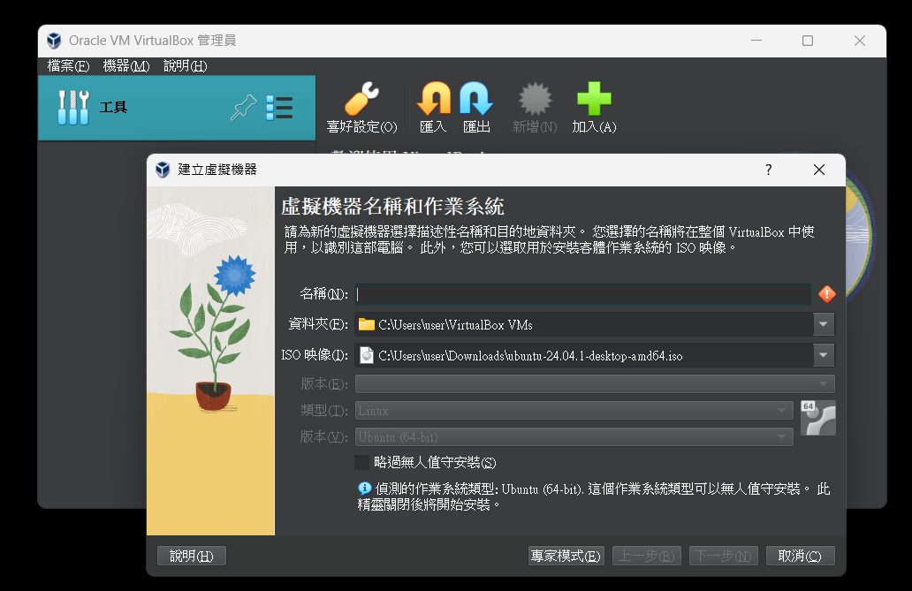

# Semi-Quantum Private Computation

## Distription

This project investigates the Quantum Private Computation (QPC) protocol, which allows participants to compare their private information without revealing any secret information. We introduce the concept of semi-quantum and propose a Semi-Quantum Private Computation (SQPC) protocol, enabling participants with limited quantum capabilities to engage in quantum secure communication protocols.

## Installation
1. Install a virtual machine(I chose [virtual box](https://www.virtualbox.org/wiki/Downloads) here)
    
    download `VirtualBox 7.0.20 platform packages` and `rtualBox 7.0.20 Oracle VirtualBox Extension Pack`

2. Download [Ubuntu Desktop](https://ubuntu.com/download)

3. Add a virtual machine with ISO of ubuntu
    
    


4. Update
```
sudo apt update
```

5. Install pip
```
sudo apt install python3-pip
```

6. Confirm
```
pip3--version
```

7. Alias
```
alias pip=pip3
```

8. Create myvenv
```
python3 -m venv myvenv
```

9. Activate
```
source myvenv/bin/activate
```

10. Go to [Netsquid](https://netsquid.org/)
    - Register first
    - pip3 install --user --extra-index-url https://<username>:<password>@pypi.netsquid.org netsquid (remove --user if you are in virtual enviroment)

11. Run test
```
import netsquid as ns
ns.test()
```

12. Install reedsolo
```
pip install reedsolo
```

13. Install pillow
```
pip install pillow
```

14. Install tkinter
```
pip install tkinter
```

15. Install imageio
```
pip install imageio
```

## Methods
Our research includes the following steps:

Generate triangle graph states.
Participants choose CHK or CALC mode, perform corresponding operations, and return ACK messages.
Publicly discuss the chosen modes, retaining measurement results from valid sessions.
Verify if the measurement results conform to the entanglement properties of the triangle graph state.
Calculate the private bit sequence, and send the results to TP via a classical channel.
TP calculates the final result.

## 模擬
We verifies 
We use Python's Netsquid package for simulation to verify the correctness of the protocol. On the Raspberry Pi, Python's Tkinter is used to present the communication process, ultimately displaying the mod 2 result of the user's message.

## Result

The proposed SQPC protocol allows two classical participants to securely compare their private messages with the assistance of a semi-honest TP (Third Party). The protocol is lightweight and practical, with potential applications in multi-party semi-quantum private computation. Our simulations successfully verified the effectiveness of the protocol, although further research and applications are needed for mod 2 results in multi-party scenarios.