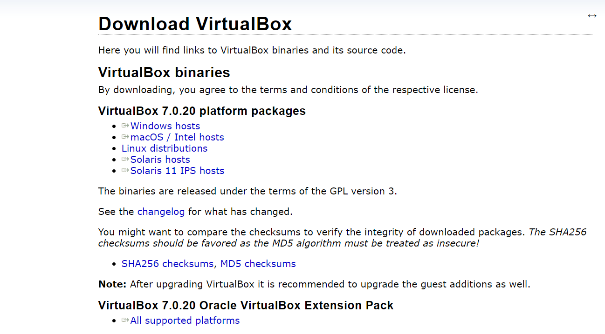
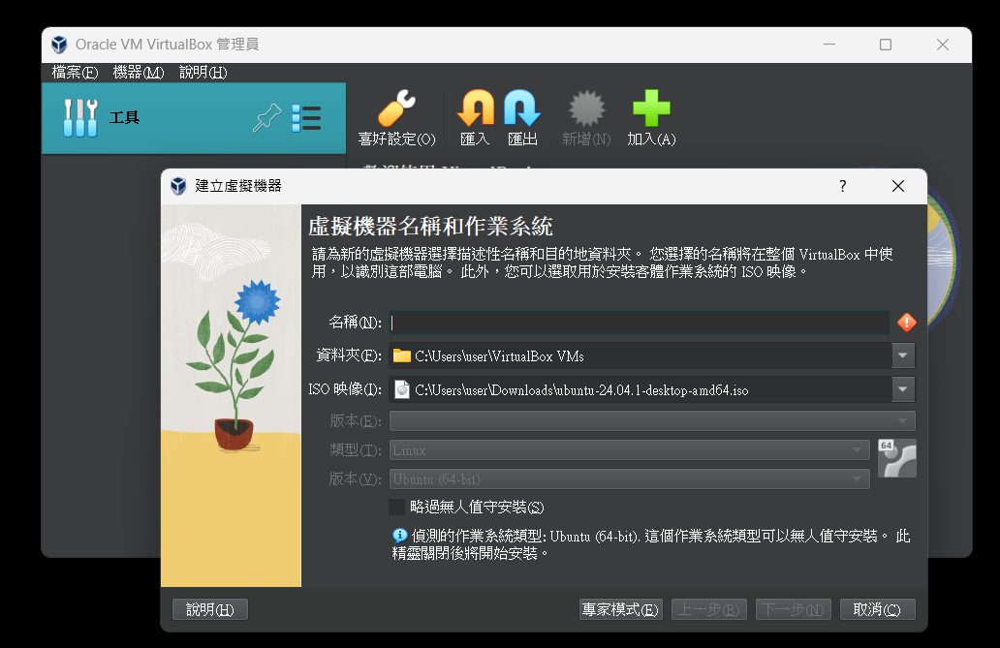

# Semi-Quantum Private Computation

## Distription

This project investigates the Quantum Private Computation (QPC) protocol, which allows participants to compare their private information without revealing any secret information. We introduce the concept of semi-quantum and propose a Semi-Quantum Private Computation (SQPC) protocol, enabling participants with limited quantum capabilities to engage in quantum secure communication protocols.

## Installation
1. Install a virtual machine(I chose [virtual box](https://www.virtualbox.org/wiki/Downloads) here)
    
    download `VirtualBox 7.0.20 platform packages` and `rtualBox 7.0.20 Oracle VirtualBox Extension Pack`

2. Download [Ubuntu Desktop](https://ubuntu.com/download)

3. 
    - add a virtual machine with ISO of ubuntu

4. 
## Usage

## Features

## 方法

我們的研究包括以下步驟：
1. 生成三角形圖狀態。
2. 參與者選擇CHK或CALC模式，執行相應的操作，並返回ACK消息。
3. 公開討論選擇的模式，保留有效會話中的測量結果。
4. 驗證測量結果是否符合三角形圖態的糾纏性質。
5. 計算私密位序列，並將結果通過經典通道發送給TP。
6. TP計算最終結果。

## 模擬

我們使用Python的Netsquid套件進行模擬，以驗證協議的正確性。樹梅派上使用Python的Tkinter來呈現通信過程，最終顯示使用者訊息的mod 2結果。

## Result

The proposed SQPC protocol allows two classical participants to securely compare their private messages with the assistance of a semi-honest TP (Third Party). The protocol is lightweight and practical, with potential applications in multi-party semi-quantum private computation. Our simulations successfully verified the effectiveness of the protocol, although further research and applications are needed for mod 2 results in multi-party scenarios.

本研究提出的SQPC協議允許兩個經典參與者在半不誠實的TP的協助下安全比對其私密消息。協議輕巧實用，並具有潛在的多方半量子私密計算應用。我們在模擬中成功驗證了協議的有效性，但在多方情況下的mod 2結果仍需進一步研究和應用。
